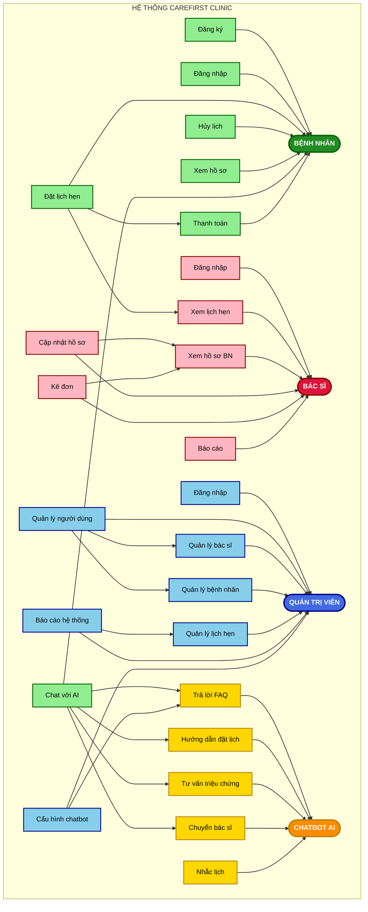

# Software Design Document (SDD)
## Project: CareFirst Clinic — Intelligent Hospital Management System with AI Chatbot

---

## 1. Introduction

### 1.1 Background Study
Trong bối cảnh hiện nay, nhiều phòng khám vẫn quản lý hồ sơ bệnh nhân và lịch hẹn theo cách thủ công hoặc bán tự động, dẫn đến:
- Thời gian tra cứu hồ sơ lâu, dễ sai sót.
- Đặt lịch qua điện thoại thường quá tải trong giờ cao điểm.
- Đơn thuốc viết tay khó đọc, dễ gây nhầm lẫn.
- Bệnh nhân không được hỗ trợ ngoài giờ hành chính.
- Danh sách chờ không minh bạch, gây bất tiện cho bệnh nhân.

Sự phát triển của công nghệ web, cơ sở dữ liệu và trí tuệ nhân tạo (AI) mở ra cơ hội để xây dựng một hệ thống quản lý phòng khám thông minh, giúp số hóa toàn bộ quy trình, nâng cao hiệu quả và trải nghiệm người dùng.

#### 1.1.1 What kind of system
Hệ thống CareFirst Clinic là một **Hospital Management System** tích hợp **AI Chatbot**, hoạt động trên nền tảng web, hỗ trợ đa thiết bị (desktop, mobile). Nó bao gồm các module chính: quản lý bệnh nhân, quản lý bác sĩ, quản lý lịch hẹn, quản lý hồ sơ y tế, kê đơn điện tử, báo cáo thống kê, và chatbot AI hỗ trợ bệnh nhân.

#### 1.1.2 Who needs the system
- **Bệnh nhân**: đặt lịch khám trực tuyến, tra cứu hồ sơ, nhận tư vấn từ chatbot.
- **Bác sĩ**: quản lý lịch làm việc, hồ sơ bệnh nhân, kê đơn thuốc điện tử.
- **Quản trị viên**: giám sát toàn hệ thống, quản lý người dùng, tạo báo cáo.
- **Phòng khám**: nâng cao hiệu quả quản lý, giảm tải nhân sự, tăng sự hài lòng của bệnh nhân.

#### 1.1.3 Why they need the system
- Giảm thời gian tra cứu hồ sơ xuống dưới 3 giây.
- Cho phép đặt lịch trực tuyến 24/7 qua web và chatbot.
- Kê đơn điện tử, có cảnh báo tương tác thuốc tự động.
- Chatbot AI hỗ trợ tư vấn triệu chứng cơ bản, hướng dẫn trước khi khám.
- Hiển thị danh sách chờ theo thời gian thực.
- Quản lý tập trung, báo cáo thông minh.

#### 1.1.4 How the proposed system can improve their activities
- **Bệnh nhân**: tiết kiệm thời gian, dễ dàng đặt lịch, được hỗ trợ ngoài giờ hành chính.
- **Bác sĩ**: quản lý hồ sơ nhanh chóng, kê đơn điện tử chính xác, giảm sai sót.
- **Quản trị viên**: có báo cáo chi tiết, giám sát hệ thống hiệu quả.
- **Phòng khám**: tăng uy tín, nâng cao chất lượng dịch vụ, tối ưu nguồn lực.

---

### 1.2 Use Case Diagram (Overview)

